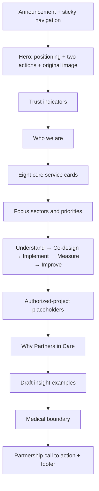

# Partners in Care Website Strategy and Launch Guide

Prepared for Partners in Care (Private) Limited  
Website version: 1.0 launch foundation  
Prepared: 31 July 2026

## 1. Brand and website strategy

### Recommended technology

The preferred implementation is Next.js with TypeScript and a component-based responsive design, deployed through a modern edge-hosting environment. This is the strongest choice for a newly established Pakistani consultancy because it provides:

- strong technical SEO and route-level metadata;
- high performance on mobile connections;
- reusable components for future portals, projects and experts;
- safe server-side handling for forms and uploads;
- a clean path to a CMS, patient portal, consultant portal and project dashboard;
- less maintenance overhead than a plugin-heavy WordPress installation.

WordPress remains a reasonable later option only if nontechnical staff must independently manage complex publishing workflows immediately and the organization is prepared to maintain theme, plugin, hosting and security updates.

### Positioning

Partners in Care occupies the space between evidence and action. Its identity should feel credible to government, donor, NGO and academic audiences while remaining human and understandable to patients, families and communities.

Primary positioning statement:

> Partners in Care connects research, evidence, professional expertise and compassionate support to help institutions, health programmes, communities and individuals achieve better health and development outcomes.

Primary tagline:

> Working Together for Healthier Communities

The primary tagline should remain because it is inclusive, partnership-led and broad enough to support both institutional services and patient support.

Alternative professional taglines:

1. Evidence into Action. Care into Impact.
2. Trusted Partnerships for Better Health.
3. Better Evidence. Stronger Systems. Healthier Communities.
4. Expertise with Care. Solutions with Purpose.
5. Together, Turning Health Priorities into Progress.

### Brand promise

Every public message should reinforce four ideas:

- reliable professional support;
- evidence-informed and context-aware methods;
- respectful, compassionate engagement;
- transparent boundaries and accountable delivery.

### Content principles

- Lead with the audience’s need, not internal organizational language.
- Use precise verbs: assess, design, implement, measure, improve.
- Clearly distinguish current capabilities, planned services and future ambitions.
- Do not claim clients, projects, funding, awards or outcomes without approval.
- Keep patient-support copy non-clinical and reinforce emergency and medical boundaries.
- Publish only public company information; protect directors’ and applicants’ private data.

## 2. Sitemap

| Level | Page | Purpose |
|---|---|---|
| 1 | Home | Establish positioning, services, trust and primary conversion pathways |
| 1 | About Us | Explain purpose, story, vision, mission, values, governance and legal status |
| 1 | Services | Present nine detailed service areas with deliverables and inquiry actions |
| 1 | Sectors | Explain support for institutional and individual audiences |
| 1 | Projects | Transparently present current, developing and completed work after approval |
| 1 | Research & Insights | Host articles, briefs, reports, tools, news and opportunities |
| 1 | Opportunities | Publish roles and collect expert-network registrations |
| 1 | Patient Support | Provide non-emergency navigation information and a safe request pathway |
| 1 | Our Experts | Present approved leadership and technical profiles |
| 1 | Partnerships | Explain collaboration models and collect partnership inquiries |
| 1 | Contact | Centralize general, proposal, partnership and patient-support inquiries |
| 1 | Search | Search public pages, services, sectors and resources |
| 2 | Privacy Policy | Explain personal-data handling |
| 2 | Terms and Conditions | Govern public website use |
| 2 | Cookie Policy | Explain essential storage and optional analytics |
| 2 | Website Disclaimer | Define general information and liability boundaries |
| 2 | Medical Disclaimer | Define non-clinical and emergency boundaries |
| 2 | Research Ethics Statement | Set research-integrity expectations |
| 2 | Safeguarding Statement | Set harm-prevention and reporting expectations |
| 2 | Anti-Fraud and Anti-Corruption | Set integrity and reporting expectations |
| 2 | Conflict-of-Interest Policy | Define disclosure and management |
| 2 | Data Protection Statement | Define data-handling principles |

Future authenticated routes should be added only after separate requirements, privacy, security and authorization work:

- `/patient-portal`
- `/consultant-portal`
- `/project-dashboard`
- `/admin`

## 3. User journeys

### Institutional client

1. Lands on the homepage through search, referral or campaign.
2. Confirms company status, positioning and service relevance.
3. Reviews a service and the sector-specific support model.
4. Opens Request a Proposal.
5. Submits scope, deliverables, timing, budget range and an optional file.
6. Receives a reference number for follow-up.

### Donor or development partner

1. Reviews public-health, MEL and project-management capabilities.
2. Checks the projects page for authorized evidence.
3. Reviews governance, ethics and legal status.
4. Submits a partnership or proposal inquiry.

### Researcher or student

1. Searches for research, systematic review, statistical analysis or manuscript support.
2. Reviews Research & Data Services and knowledge-hub content.
3. Submits a defined research-support request.

### Consultant or healthcare professional

1. Opens Opportunities or Our Experts.
2. Reviews the expert-network purpose and privacy wording.
3. Submits professional details, consent and CV.
4. Receives a reference while understanding that registration does not guarantee an assignment.

### Patient or family

1. Opens Patient Support.
2. Sees the emergency warning and medical disclaimer immediately.
3. Reviews the types of non-clinical help available.
4. Submits only minimum necessary contact and navigation information.
5. Receives a reference and consults licensed professionals for diagnosis or treatment.

## 4. Page-by-page content

All page copy is implemented in the website. The editorial structure is:

- Home: announcement, hero, trust indicators, company overview, services, focus areas, work process, project placeholders, reasons to choose the company, draft insight examples, medical boundary and calls to action.
- About: story, meaning of the name, vision, mission, values, strategic objectives, approach, governance, leadership placeholders, technical network, ethics and legal status.
- Services: nine expandable service profiles, each covering scope, audience, deliverables, process, benefits and an inquiry action.
- Sectors: nine audience-specific support profiles without unsupported claims.
- Projects: category filters, four transparent placeholders and a standard project template.
- Research & Insights: resource categories, filters, three clearly labelled draft examples and editorial principles.
- Opportunities: seven opportunity pathways and a privacy-conscious expert-registration form.
- Patient Support: emergency warning, six support types, medical boundary, request form and FAQ.
- Our Experts: seven approved-profile placeholders and expertise filtering framework.
- Partnerships: seven collaboration types and a partnership inquiry form.
- Contact: public office information, map placeholder, general inquiry, proposal, partnership and patient-support forms.
- Legal pages: ten structured drafts clearly marked for legal review.

## 5. Homepage wireframe



Desktop composition uses a calm, editorial left-to-right reading pattern. Mobile composition brings the image above the hero copy, converts cards to one column and preserves full-width calls to action.

## 6. Design-system specifications

### Logo concept

The supplied mark uses two abstract human figures joining around a subtle heart-shaped negative space. It represents partnership, care and community without implying a hospital, government body or clinical facility.

### Colour system

| Token | Hex | Use |
|---|---|---|
| Deep navy | `#062434` | High-trust backgrounds and headings |
| Navy | `#0B3148` | Navigation, primary institutional tone |
| Teal | `#08796F` | Health, care, links and active states |
| Bright teal | `#20A99B` | Accents and process signals |
| Soft teal | `#DFF4F0` | Supportive backgrounds and badges |
| Warm accent | `#D66B3D` | Primary calls to action |
| Ink | `#18323F` | Body text |
| Muted text | `#5B6D75` | Secondary text |
| Soft grey | `#F4F8F8` | Section backgrounds |
| Border | `#DBE5E6` | Dividers and field borders |
| White | `#FFFFFF` | Main surface |

### Typography

- Font stack: Inter, Aptos, Segoe UI, Roboto, Helvetica, Arial, sans-serif.
- Headings: 680–700 weight, tight tracking, compact line height.
- Body: 400–500 weight, 1.65–1.8 line height.
- Minimum body size: 16 px.
- Small legal or metadata text should not fall below 12 px.

### Components

- Rounded pill actions for warmth and accessibility.
- Rounded cards with subtle borders and restrained shadows.
- Sticky desktop navigation and compact mobile disclosure menu.
- Native `<details>` accordions for keyboard-accessible services and FAQs.
- Visible focus rings, descriptive labels and status messages.
- Reduced-motion support for users who request it.

## 7. Complete website code

The complete working implementation includes:

- Next.js route architecture with TypeScript;
- reusable navigation, footer, logo, headings, calls to action and form components;
- structured arrays for services, sectors, projects, opportunities, experts and insights;
- secure server-side form validation;
- D1 submission records and private R2 file uploads;
- same-origin checks, honeypot spam protection, minimum completion timing and basic rate limiting;
- search, sitemap, robots directives and structured data;
- responsive mobile-first styling;
- an environment-variable example with no exposed secret keys.

## 8. File and folder structure

```text
app/
  [slug]/page.tsx
  api/inquiries/route.ts
  search/page.tsx
  globals.css
  layout.tsx
  page.tsx
  robots.ts
  sitemap.ts
components/
  ContentFilters.tsx
  CookieBanner.tsx
  Footer.tsx
  Header.tsx
  InquiryForm.tsx
  JsonLd.tsx
  Logo.tsx
  SearchResults.tsx
  UI.tsx
db/
  index.ts
  schema.ts
drizzle/
lib/
  site.ts
public/
  images/
  favicon.svg
  partners-in-care-logo.svg
.env.example
README.md
WEBSITE_STRATEGY_AND_LAUNCH_GUIDE.md
```

## 9. Form and database structure

### Forms

| Form | Main purpose | File |
|---|---|---|
| General inquiry | Questions and service inquiries | None |
| Request a proposal | Institutional scope and procurement information | Optional PDF, DOC, DOCX or XLSX |
| Partnership inquiry | Proposed collaboration | None |
| Patient-support request | Minimum necessary non-emergency navigation information | None |
| Expert registration | Future consultancy and collaboration matching | Required CV |
| Newsletter | Consented update subscription | None |

### Data safeguards

- Files are limited to 8 MB and approved extensions.
- Uploads are stored in a private object-storage path.
- The public website exposes no file-download route.
- Form data is validated server-side.
- Raw IP addresses are not stored by the application.
- A 180-day review date is recorded for every submission.
- Approved administrators must operate a routine review and deletion process.
- Patient forms warn against detailed records and emergency information.

### Database fields

`id`, `form_type`, `full_name`, `email`, `phone`, `organisation`, `payload_json`, `status`, `consent`, attachment metadata, `retained_until`, `created_at`, `updated_at`.

### Email or workflow integration

The server can send a minimal alert to an approved secure workflow by configuring `FORM_NOTIFICATION_WEBHOOK` in the hosting environment. The alert contains the reference, form type, name, email, timestamp and whether an attachment exists; it does not expose uploaded file contents.

For direct email delivery, connect the webhook to an approved transactional-email or case-management service. Never place API keys in frontend JavaScript or commit them to source control.

## 10. SEO metadata

| Page | SEO title focus | Core search intent |
|---|---|---|
| Home | Public Health & Research Consultancy in Pakistan | Broad company and service discovery |
| About | About Partners in Care | Legal status, values and credibility |
| Services | Public Health, Research & Project Services | Consultancy and technical services |
| Sectors | Sectors We Support | Government, donor, NGO, health and academic audiences |
| Projects | Projects & Partnership Opportunities | Delivery evidence and future collaboration |
| Insights | Research & Insights | Knowledge and opportunity discovery |
| Opportunities | Careers, Consultancies & Expert Network | Professional registration and vacancies |
| Patient Support | Patient Navigation & Support | Non-emergency navigation in Pakistan |
| Experts | Our Experts | Consultant and technical-network discovery |
| Partnerships | Partner With Us | Institutional collaboration |
| Contact | Contact & Request a Proposal | Qualified inquiry and conversion |

Implemented technical SEO:

- canonical route metadata;
- page-specific titles and descriptions;
- Open Graph and social-sharing images;
- Organization and ProfessionalService schema;
- Service ItemList schema;
- breadcrumb schema;
- patient FAQ schema;
- XML sitemap;
- robots directives;
- descriptive headings and semantic landmarks;
- fast WebP hero image.

Before indexing:

1. Confirm the official domain.
2. Set `NEXT_PUBLIC_SITE_URL`.
3. Verify ownership in Google Search Console.
4. Submit `/sitemap.xml`.
5. Review page titles and public contact information.
6. Activate analytics only after approved consent and privacy settings.

## 11. Legal-page drafts

Drafts are included for:

- Privacy Policy
- Terms and Conditions
- Cookie Policy
- Website Disclaimer
- Medical Disclaimer
- Research Ethics Statement
- Safeguarding Statement
- Anti-Fraud and Anti-Corruption Statement
- Conflict-of-Interest Policy
- Data Protection Statement

Every draft is visibly labelled for legal review. Qualified Pakistani legal counsel should confirm applicable corporate, electronic-transactions, consumer, employment, data-protection, healthcare, research and tax requirements before publication.

## 12. Testing checklist

### Functional

- [ ] Every navigation and footer link resolves correctly.
- [ ] Mobile menu opens and links remain reachable.
- [ ] Search returns services, sectors and pages.
- [ ] Service and FAQ accordions work by keyboard and touch.
- [ ] Every form enforces required fields.
- [ ] Invalid email and oversized or unsupported files are rejected.
- [ ] Successful submissions return a reference number.
- [ ] D1 records and R2 uploads are private and retrievable only by authorized administrators.
- [ ] Optional webhook alerts arrive without exposing uploaded files.
- [ ] Cookie choice persists and optional analytics remain disabled without consent.

### Accessibility

- [ ] Keyboard-only navigation is complete.
- [ ] Focus indicators are visible.
- [ ] Heading hierarchy is logical.
- [ ] Labels and error/status messages are announced.
- [ ] Colour contrast meets WCAG-conscious targets.
- [ ] Text remains usable at 200% zoom.
- [ ] Reduced-motion preference is respected.
- [ ] Decorative images have empty alternative text; informative images have meaningful text.

### Responsive

- [ ] 360 px mobile
- [ ] 390 px mobile
- [ ] 768 px tablet
- [ ] 1024 px laptop
- [ ] 1440 px desktop
- [ ] Landscape mobile

### Security and privacy

- [ ] HTTPS is enforced.
- [ ] Hosting environment contains no public secret keys.
- [ ] Form-origin, spam, rate and file controls are tested.
- [ ] Authorized administrators and retention responsibilities are documented.
- [ ] Backup and incident-response procedures are approved.
- [ ] Patient and applicant privacy wording is approved.

### Content and legal

- [ ] No fabricated project, client, partner, award or impact claim appears.
- [ ] All team qualifications and photos are verified and consented.
- [ ] No CNIC, residential address, signature or shareholding detail appears.
- [ ] Medical, research, safeguarding and legal boundaries are approved.
- [ ] All placeholders are resolved or intentionally retained.

## 13. Deployment instructions

### Local installation

1. Install Node.js 22.13 or later.
2. Install locked dependencies with `npm ci`.
3. Copy `.env.example` to `.env.local` and add only approved local values.
4. Run `npm run dev`.
5. Build with `npm run build`.

### Production

1. Connect the source repository to an HTTPS-ready Next.js hosting environment.
2. Provision the configured D1 database and R2 private bucket.
3. Apply the generated database migration.
4. Set `NEXT_PUBLIC_SITE_URL` to the approved canonical domain.
5. Set the optional server-only notification webhook through protected environment settings.
6. Deploy the production build.
7. Test every form and route.
8. Configure the custom domain and DNS.
9. Register Search Console and submit the sitemap.

### CMS recommendation

At launch, structured website content is maintained in `lib/site.ts`. For staff publishing at scale, add a headless CMS such as Sanity, Contentful, Strapi or WordPress in headless mode. The CMS should use role-based access, approval workflow, revision history, scheduled publishing and separate content types for projects, insights, opportunities and experts.

## 14. Maintenance plan

| Frequency | Task | Responsible role |
|---|---|---|
| Weekly | Review and assign new inquiries | Approved business-development or programme lead |
| Weekly | Review failed submissions and security alerts | Technical administrator |
| Monthly | Update opportunities, news and approved project status | Communications lead |
| Monthly | Review privacy retention dates and securely delete inactive submissions | Data-protection owner |
| Quarterly | Test forms, uploads, backups and restore procedures | Technical administrator |
| Quarterly | Review accessibility, broken links and page speed | Web/communications team |
| Six-monthly | Review legal, medical, research and safeguarding wording | Management and qualified advisers |
| Annually | Review strategy, services, SEO priorities and content governance | Leadership |

## 15. Pre-Launch Information Checklist

### Corporate and brand

- [ ] Approve the final logo and brand files.
- [ ] Confirm the primary tagline.
- [ ] Confirm the preferred public short name.
- [ ] Verify CUIN, incorporation date, legal wording and office address.
- [ ] Confirm whether the basement office wording is exactly correct for public use.

### Contact

- [ ] Insert the official general inquiry email.
- [ ] Insert the careers email.
- [ ] Insert an approved public telephone number.
- [ ] Insert an approved WhatsApp number and activate the direct link.
- [ ] Confirm business hours and holiday arrangements.
- [ ] Confirm map coordinates and approved map provider.
- [ ] Add approved social-media links.

### People

- [ ] Approve leadership names, titles and biographies.
- [ ] Verify qualifications and professional registrations.
- [ ] Obtain written consent for photographs and profile publication.
- [ ] Approve categories and ordering for team profiles.

### Services and operations

- [ ] Confirm which services are immediately available.
- [ ] Identify services that should be labelled “planned” or “available through partners.”
- [ ] Approve inquiry-response owners and service-level expectations.
- [ ] Confirm proposal budget ranges and currencies.
- [ ] Define patient-navigation operating hours, geography and scope.
- [ ] Approve referral and emergency escalation procedures.

### Projects and evidence

- [ ] Approve every project title, client name and partner name before publication.
- [ ] Obtain consent to publish location, duration, results, images and documents.
- [ ] Verify all statistics, results and lessons.
- [ ] Approve the distinction between company projects and founders’ prior experience.

### Forms, privacy and safeguarding

- [ ] Appoint a data-protection owner.
- [ ] Approve the retention and deletion schedule.
- [ ] Approve access roles for inquiries, CVs and uploads.
- [ ] Configure the secure notification workflow.
- [ ] Test file scanning or add an approved scanning service before operational use.
- [ ] Approve safeguarding and whistleblowing reporting channels.
- [ ] Approve consent language for all forms.
- [ ] Confirm the legal basis for newsletters and marketing communications.

### Legal

- [ ] Obtain Pakistani legal review of all ten policy drafts.
- [ ] Confirm applicable data-protection and electronic-communications requirements.
- [ ] Confirm professional and clinical boundaries.
- [ ] Confirm recruitment-support wording does not imply an unlicensed recruitment agency.
- [ ] Confirm tax, invoice and contracting disclosures required on the website.

### SEO, analytics and launch

- [ ] Confirm and connect the official domain.
- [ ] Set the canonical website URL.
- [ ] Approve all page titles and descriptions.
- [ ] Configure Search Console.
- [ ] Submit the XML sitemap.
- [ ] Choose an analytics provider and approve consent settings.
- [ ] Complete accessibility, mobile, security and performance testing.
- [ ] Remove or intentionally retain every square-bracket placeholder.
- [ ] Approve the final production launch.

